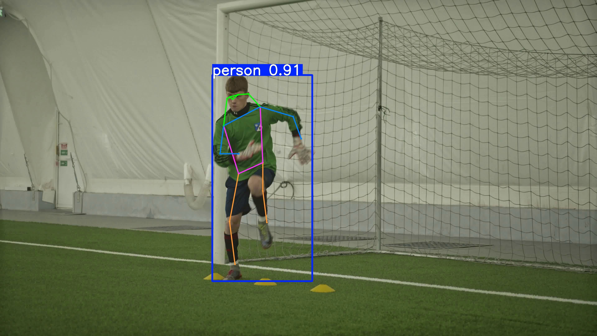
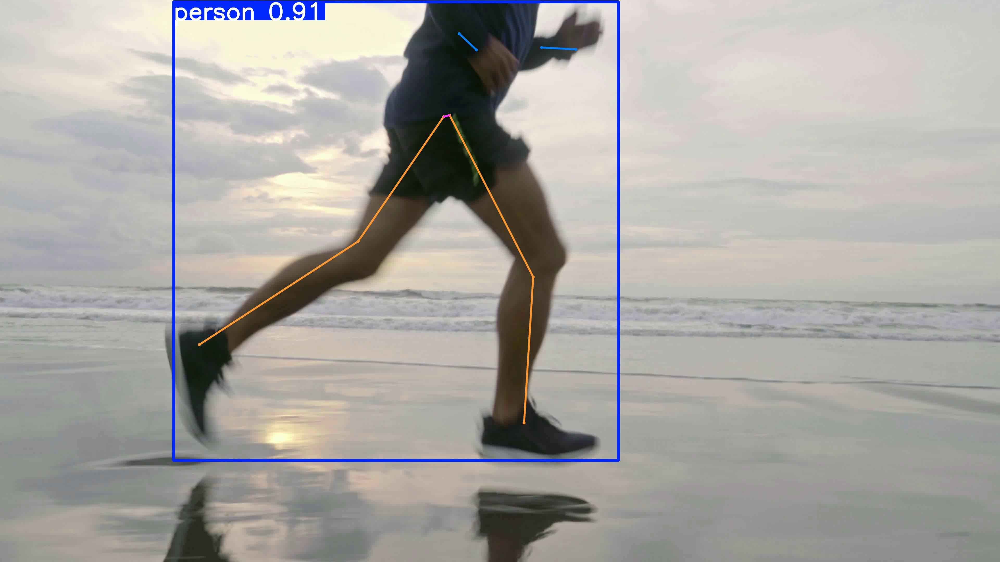

# Pose Estimation — Live & Batch

This project demonstrates pose/keypoint estimation in two ways:
- A browser demo using `p5.js` + `ml5` (PoseNet) for live webcam or local video playback.
- A Python batch processor (`process_videos.py`) that annotates all videos in `videos/` using MediaPipe and writes annotated videos and snapshots to `outputs/`.

**Quick Highlights**
- **Live demo**: open `index.html` via a local server and choose `Webcam` or a video from the dropdown.
- **Batch annotate**: run `process_videos.py` to generate `outputs/annotated_<video>` and snapshots.

**Files of interest**
- `index.html`: browser UI and selector
- `sketch.js`: p5 + ml5 PoseNet integration, supports webcam + `videos/*.mp4`
- `process_videos.py`: Python script that annotates videos with keypoints (MediaPipe)
- `requirements.txt`: Python dependencies for the processor
- `videos/`: put your input videos here (the repo includes `football.mp4`, `running.mp4`)
- `images/`: small assets used by the demo (e.g. `batman.png`, `khan.jpg`)

**How to run (Windows PowerShell)**

1) Start the browser demo (serving files via a simple HTTP server so the browser can load video files):

```powershell
# from the project root
python -m http.server 8000;
# open http://localhost:8000 in your browser
```

Then open `http://localhost:8000` in Chrome/Edge and select `Webcam` or a video from the select box. If you want to allow webcam access, grant the permission when prompted.

2) Run the batch video annotator (creates annotated videos + snapshots and a `videos/videos.json` file used by the browser UI):

```powershell
# create a virtualenv (optional but recommended)
python -m venv .venv;
.\.venv\Scripts\Activate.ps1;
pip install -r requirements.txt;
python process_videos.py;
```

After it runs you'll find annotated outputs in `outputs/` (e.g. `outputs/annotated_running.mp4`, and `outputs/running_snapshot.jpg`). The script also writes `videos/videos.json` which populates the dropdown in the browser UI.

**Python version note**
 - `mediapipe` may not be available on very new Python releases. If `pip install -r requirements.txt` fails to find `mediapipe`, create a virtual environment using Python 3.10 or 3.11 and try again. Example with Chocolatey/installed Python:

```powershell
# create a venv backed by a compatible Python (3.10/3.11)
python3.11 -m venv .venv; 
.\.venv\Scripts\Activate.ps1; 
pip install -r requirements.txt;
python process_videos.py;
```


**What the scripts do**
- `sketch.js` — captures webcam frames or plays a selected video and sends the chosen element to `ml5.poseNet`. Detected keypoints and skeleton lines are drawn onto the canvas in real time.
- `process_videos.py` — loads each video from `videos/`, runs MediaPipe Pose on every frame, draws landmarks and connections, writes an annotated video to `outputs/` and saves the first annotated frame as a snapshot image.

**Annotated outputs (generated)**
You can find the annotated videos produced by the Ultralytics processor in the repository:

- `videos/annotated_football.mp4` — annotated keypoints overlay for `football.mp4`.
- `videos/annotated_running.mp4` — annotated keypoints overlay for `running.mp4`.

I also generated thumbnails saved in `images/`:

- `images/annotated_football_thumb.jpg`
- `images/annotated_running_thumb.jpg`

Preview (click to open the video in the repo):

- Football:  — `videos/annotated_football.mp4`
- Running:  — `videos/annotated_running.mp4`

**YouTube Demos**

You uploaded annotated videos to YouTube — the README links below use clickable thumbnails that open the videos on YouTube (GitHub does not allow direct iframe embeds in README files).

- **Football**: [](https://www.youtube.com/watch?v=SZ1sjwjK9xg)
- **Running**: [](https://www.youtube.com/watch?v=puZ_7-WxDvk)

To regenerate these annotated outputs locally I used `process_videos_ultralytics.py` (Ultralytics prediction) and `convert_and_copy.py` (re-encode `.avi` to `.mp4` and extract thumbnails).

**Customizing**
- To change the overlay graphic used in the browser demo, replace `images/batman.png`.
- To use a different Python pose model (e.g. YOLO-Pose), you can modify `process_videos.py` accordingly; MediaPipe was chosen for portability and easy install.

**Tips**
- If a local video doesn't appear in the browser dropdown after running the Python script, reload the page or ensure `videos/videos.json` exists.
- For larger videos, the annotator may take several minutes — check `outputs/` as files are written.

**License & Acknowledgements**
This repository uses `ml5.js` (PoseNet) in-browser and `mediapipe` for the Python processor.

---

If you'd like, I can:
- Run `process_videos.py` now and add the generated annotated videos/screenshots into the repo.
- Replace MediaPipe with the YOLO pose model in `process_videos.py`.
- Add a tiny `run_demo.bat` and `run_processor.bat` for Windows convenience.

