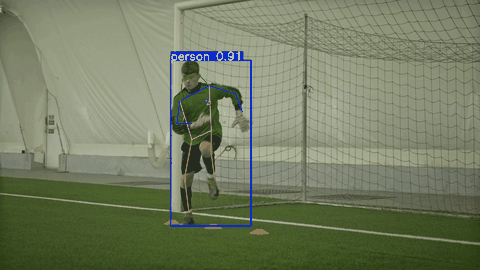
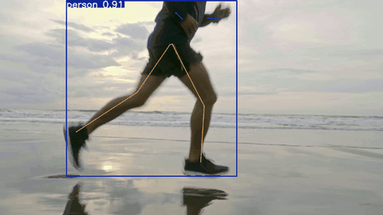

# 🎯 Human Pose Estimation

> A comprehensive pose estimation system combining browser-based real-time detection with batch video processing. Detect and annotate human keypoints in videos using PoseNet and MediaPipe.

<p align="center">
  <a href="https://www.youtube.com/watch?v=SZ1sjwjK9xg" target="_blank">
    
  </a>
  <a href="https://www.youtube.com/watch?v=puZ_7-WxDvk" target="_blank">
    
  </a>
</p>

<p align="center">
  <strong>Click the GIFs above to watch full demos on YouTube →</strong>
</p>

---

## 📋 Table of Contents

- [🌟 Features](#-features)
- [📦 Project Structure](#-project-structure)
- [🚀 Quick Start](#-quick-start)
- [📖 Documentation](#-documentation)
- [🛠️ Advanced Usage](#-advanced-usage)
- [🎨 Customization](#-customization)
- [❓ Troubleshooting](#-troubleshooting)
- [📜 License & Acknowledgements](#-license--acknowledgements)

---

## 🌟 Features

✨ **Browser-Based Demo**
- Real-time pose detection with p5.js + ml5 PoseNet
- Play and annotate local video files
- Interactive keypoint visualization with skeleton lines
- Smooth, responsive web interface

🎬 **Batch Video Processing**
- Automated pose annotation for multiple videos
- Powered by MediaPipe and Ultralytics
- Generate annotated MP4s and frame snapshots
- Configurable detection confidence thresholds

📊 **Multiple Detection Backends**
- **ml5.js PoseNet**: in-browser, fast, real-time
- **MediaPipe**: Python-based batch processing
- **Ultralytics**: YOLO-Pose alternative for higher accuracy

---

## 📦 Project Structure

```
├── index.html                      # Browser UI (p5.js + ml5)
├── sketch.js                       # Main p5 sketch with PoseNet integration
├── pose-yolo.py                    # Example YOLO Pose setup
├── process_videos.py               # MediaPipe batch processor
├── process_videos_ultralytics.py   # Ultralytics YOLO batch processor
├── convert_and_copy.py             # Convert outputs to MP4 + extract thumbnails
├── generate_gifs.py                # Generate preview GIFs
├── images/                         # Assets & thumbnails
│   ├── annotated_football.gif      # Football demo preview
│   ├── annotated_running.gif       # Running demo preview
│   ├── annotated_*_thumb.jpg       # Keyframe snapshots
│   ├── batman.png                  # Overlay graphic for demo
│   └── khan.jpg                    # Example overlay
├── videos/                         # Input & annotated videos
│   ├── football.mp4                # Original input
│   ├── running.mp4                 # Original input
│   ├── annotated_football.mp4      # Processed output
│   ├── annotated_running.mp4       # Processed output
│   └── videos.json                 # Video list for browser UI
├── requirements.txt                # Python dependencies
└── README.md                       # This file
```

---

## 🚀 Quick Start

### Option 1: Browser Demo (Recommended for First Time)

**Prerequisites:** Python 3.8+

1. **Start the local server:**
   ```powershell
   python -m http.server 8000
   ```

2. **Open in your browser:**
   ```
   http://localhost:8000
   ```

3. **Select a video from the dropdown** and watch pose keypoints annotate in real-time!

### Option 2: Batch Process Your Own Videos

1. **Setup environment:**
   ```powershell
   python -m venv .venv
   .\.venv\Scripts\Activate.ps1
   pip install -r requirements.txt
   ```

2. **Add your videos:**
   - Place `.mp4` or `.avi` files in the `videos/` folder

3. **Run the processor:**
   ```powershell
   python process_videos_ultralytics.py
   ```

4. **Convert to MP4 and create GIFs:**
   ```powershell
   python convert_and_copy.py
   python generate_gifs.py
   ```

5. **Results appear in `videos/` and `images/`**

---

## 📖 Documentation

### Browser Demo Usage

- **Select Video**: Choose from the dropdown menu (populated from `videos/videos.json`)
- **View Keypoints**: Green circles mark 17 body keypoints (PoseNet model)
- **Skeleton Lines**: Yellow lines connect related joints
- **Overlay**: Batman logo follows the detected pose

### Video Processing Pipeline

| Step | Script | Input | Output |
|------|--------|-------|--------|
| 1. Detect & Annotate | `process_videos_ultralytics.py` | `videos/*.mp4` | `runs/pose/predict*/` |
| 2. Move Outputs | `move_runs_outputs.py` | `runs/` | `outputs_ultralytics/` |
| 3. Convert to MP4 | `convert_and_copy.py` | `.avi` files | `videos/annotated_*.mp4` |
| 4. Generate GIFs | `generate_gifs.py` | `.mp4` files | `images/annotated_*.gif` |

---

## 🛠️ Advanced Usage

### Python Version Compatibility

⚠️ **MediaPipe** requires Python 3.10 or 3.11. If installation fails:

```powershell
# Use Python 3.11 instead
python3.11 -m venv .venv
.\.venv\Scripts\Activate.ps1
pip install -r requirements.txt
```

### Switching Detection Backends

**Current (Ultralytics):**
```powershell
python process_videos_ultralytics.py
```

**Using MediaPipe:**
```powershell
python process_videos.py
```

**Using YOLO-Pose:**
```powershell
python pose-yolo.py
```

### Adjusting Detection Settings

Edit `process_videos_ultralytics.py`:
```python
model.predict(
    source=str(path),
    conf=0.25,      # ← Lower = more detections, higher = stricter
    save=True,
    device='cpu'    # Change to 'cuda' if using NVIDIA GPU
)
```

---

## 🎨 Customization

### Change the Overlay Graphic

1. Replace `images/batman.png` with your own `.png` file (same size)
2. Update `sketch.js` line 18 if needed:
   ```javascript
   face_img = loadImage("images/batman.png");
   ```

### Add More Videos

1. Copy `.mp4` or `.avi` files to `videos/`
2. Run the processor script (it auto-detects all videos)
3. Refresh the browser UI to see new options

### Adjust Canvas Size

Edit `sketch.js` line 16:
```javascript
createCanvas(630, 450, 0, 0);  // width, height
```

---

## ❓ Troubleshooting

| Issue | Solution |
|-------|----------|
| **"Port 8000 already in use"** | Kill existing process: `netstat -ano \| findstr :8000` → `taskkill /PID <pid>` |
| **Video doesn't appear in dropdown** | Ensure `videos/videos.json` exists; refresh browser |
| **No keypoints detected** | Increase confidence threshold (lower `conf` value) |
| **"ModuleNotFoundError: No module named 'mediapipe'"** | Use Python 3.10/3.11; reinstall: `pip install mediapipe` |
| **GIF generation fails** | Install Pillow: `pip install Pillow` |

---

## 📜 License & Acknowledgements

This project uses:
- **[ml5.js](https://learn.ml5js.org/)** — PoseNet model for browser-based pose detection
- **[MediaPipe](https://mediapipe.dev/)** — Google's lightweight pose estimation framework
- **[Ultralytics YOLOv8](https://github.com/ultralytics/ultralytics)** — YOLO-Pose for batch processing
- **[p5.js](https://p5js.org/)** — Creative coding library

Licensed under the MIT License. See `LICENSE` file for details.

---

<p align="center">
  Made with ❤️ for pose estimation enthusiasts
  <br/>
  <a href="https://github.com/Mohammad-Akhtar-Awan/human-pose-estimation">⭐ Star on GitHub</a>
</p>
